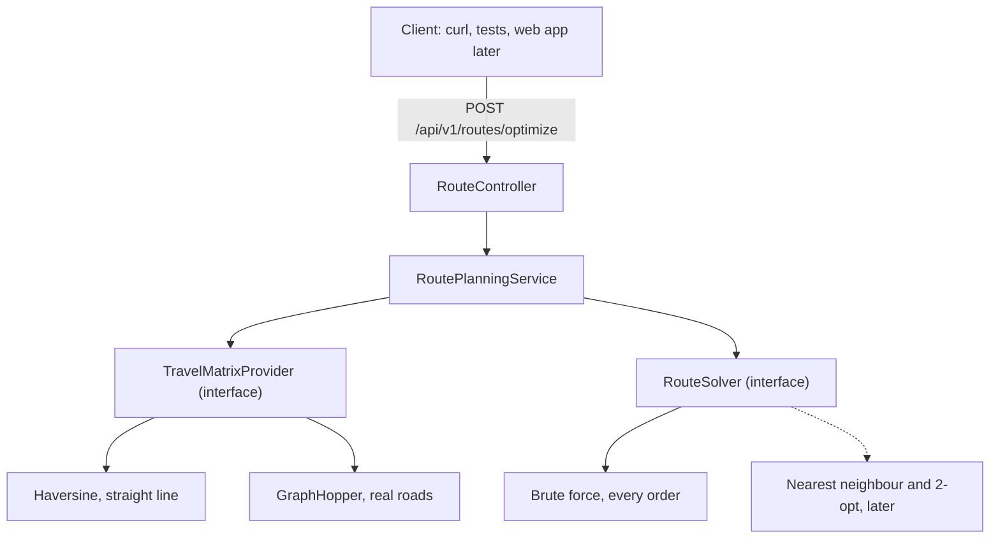

# Architecture

How the pieces fit together, and the two decisions that keep the later steps cheap.

## Request flow

Dotted lines are not built yet. Exactly one distance provider is active, chosen by `routeplanner.routing.provider` in `application.yaml`.

1. The controller takes JSON, validates it, and turns it into domain objects.
2. The service asks a matrix provider for travel figures between every pair of places.
3. The service turns those figures into a cost matrix. Today cost means distance.
4. The solver returns the cheapest order it can find.
5. The service builds the answer: the ordered stops, each leg, and the totals.

## Components

| Package | Responsibility |
| --- | --- |
| `api` | HTTP only. Controller, request and response records, validation, error handling |
| `planning` | The domain. Cost matrices, solvers, the resulting plan. Plain Java, no Spring annotations |
| `distance` | Where travel figures come from. The provider interface and its implementations |

Nothing in `planning` knows about HTTP, and nothing in `api` knows how distances are calculated.

## The two seams

**Travel figures arrive through an interface.** The service never calls haversine or GraphHopper itself. At step 3 a second implementation replaces straight lines with real driving distances, and the service, the solver and the controller stay untouched.

The interface hands back a whole matrix rather than one pair at a time, because routing engines calculate many-to-many distances in a single pass. Asking pair by pair would be far slower once real roads arrive.

**The solver minimises a cost matrix without knowing what cost means.** Distance fills it today. Seconds or litres can fill it later. That turns "fastest or most fuel-efficient" into a decision about how the matrix is built, not a rewrite of the algorithm.

## Units and limits

| Thing | Decision |
| --- | --- |
| Coordinates | WGS84 decimal degrees, the numbers Google Maps shows |
| Distance | Kilometres. Rounded to two decimals in responses only, never during calculation |
| Duration | Seconds, from step 3 onwards |
| Stops per request | 10 at most. Checking every order grows by factorial, so 10 stops is already 3.6 million |
| Start | Required. Returning to it is optional |

## Two things real roads brought with them

**Distances stopped being symmetric.** A straight line from A to B equals the line back. A drive does not, because of one-way streets and motorway ramps, so every ordered pair is calculated separately rather than mirroring half the table.

**Some places cannot be reached at all.** A coordinate away from any street, on an airfield or inside a park, has nothing to snap to. That is not a broken request and not a broken server, so it answers 422 naming the place, rather than failing with a 500.

## Deliberately absent

Traffic data, because OpenStreetMap has none and live traffic costs money. Several drivers, time windows and vehicle capacity, until the single driver version is stable. Authentication, because there is nothing private to protect yet. Turn by turn navigation, which is handed to Google Maps or Waze.

## What each step changes

| Step | Change to this picture |
| --- | --- |
| 2 | A `places` table in PostgreSQL and a repository behind a new endpoint. The flow above is untouched |
| 3 | **Done.** A second `TravelMatrixProvider` backed by GraphHopper, chosen by configuration. The service, the solver and the controller were not touched, which is what the seam was for |
| 4 | A React app calling the same endpoint. No backend change |
| 5 | Vehicle details arrive in the request and reach the matrix provider |
| 6 | A second way to fill the cost matrix, using fuel instead of distance |
